# 礼达 Meet-Gifts · 使用手册

> 公司节日福利发放系统 · v0.3 · 2026-05-27

**开发者**：[Zhang Zhiyao · © 2026 All rights reserved](https://www.linkedin.com/in/zhang-zhiyao-bluebell/)

**MVP产品展示链接**：[meet-gifts-app](https://meet-gifts.vercel.app/)

**项目仓库**：[github.com/zzybluebell/meet-gift](https://github.com/zzybluebell/meet-gift)

**用户设计流程图**：[user-workflow.pdf](https://drive.google.com/file/d/1UuHkirItJxL3XLSUMqKoXtrZLl0p5Tmw/view?usp=sharing)

---

## 系统目标：

「礼达 Meet-Gifts」是一套**为行政同学设计的节日福利礼物发放与领用流程系统**：

- 服务 **3000 人规模** 的中大型公司，员工分散在**同一城市多个不同的办公大楼**
- 帮 **行政同学** 把礼物库存管得准、活动跑得稳：谁能领、领什么、去哪取、剩多少，一目了然
- 让 **公司员工** 在手机上几步就能完成领取 —— 不用填表、不用排队、不用问 HR

把过去"行政用 Excel 发表单、微信群催领、纸质名单跨楼跑"的麻烦做法，换成一套统一的线上流程：

- **HR / 行政** 在电脑上配置活动、设置谁能领、看进度、管多楼宇库存
- **员工** 在手机上收通知、预约礼物、拿核销码
- **分仓负责人** 在每栋楼的提货点用手机扫码 / 输码、把礼物递出去

请按你的角色翻到对应章节：

- 🏢 [我是行政 / HR](#-第一部分--行政--hr)
- 👤 [我是员工](#-第二部分--员工)
- ✅ [我是分仓核销员](#-第三部分--分仓核销员)

---

# 🏢 第一部分 · 行政 / HR

## 1. 第一次用？按这个顺序走

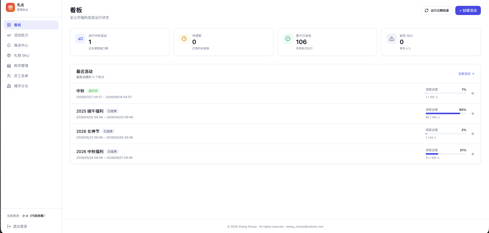

刚接手系统的话，照下面 5 步走，半小时跑通第一次福利活动。

**Step 1 · 检查楼宇和分仓**
左侧菜单点"楼宇"。看一眼公司有几栋楼、每栋楼的提货点是不是已经录入。没有就加。

**Step 2 · 检查员工花名册**
左侧菜单点"员工"。看员工是不是都在、每个人是不是分到了对应的楼宇。

- 加几个 → 右上"添加员工"
- 加一批 → "批量导入"上传 Excel

**Step 3 · 录入礼物**
左侧菜单点"礼物"→ "+ 新增礼物"。录名称、图、估值，食品类要标过敏原。

> 录的同时给每个分仓设个初始库存。

**Step 4 · 创建活动**
左侧菜单点"活动"→ "+ 新建活动"，4 步走完发布。详见 §2。

**Step 5 · 看进度**
回看板，能看到员工陆续来领。结束前 24 小时系统自动催未领的人，你不用管。

---

## 2. 怎么创建一个活动？

进"活动"页 → 点 "+ 新建活动"，按 4 步走：

### ① 起名

- 取员工能看懂的名字（"中秋月饼福利" 好过 "Q3-MA-2026"）
- 选节日类型（系统按节日给联动的起止日期）
- 加段描述（员工会在卡片上看到）

### ② 决定谁能领

"资格规则" 支持 6 个条件 + AND/OR 组合：

| 条件     | 用法举例                       |
| -------- | ------------------------------ |
| 全员     | 春节福利                       |
| 性别     | 三八节 → 性别 = 女             |
| 司龄     | 司庆 → 司龄 ≥ 5 年             |
| 是否有娃 | 儿童节 → 有娃 = 是             |
| 部门     | 程序员节 → 部门 ∈ {研发, 测试} |
| 楼宇     | 单楼试点 → 楼宇 ∈ {A 座}       |

改规则时，下方实时显示"符合 X 人"。

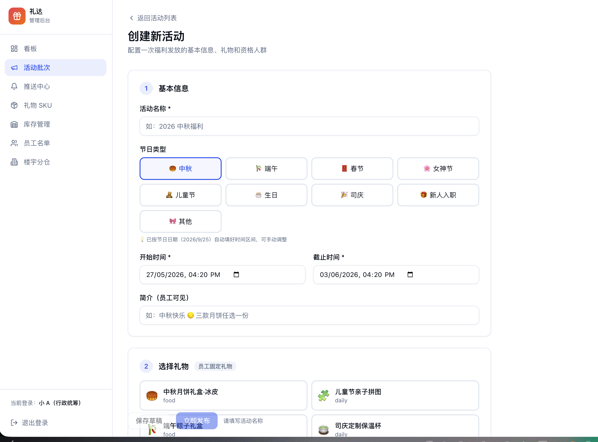

### ③ 挑礼物

两种模式：

- **固定** —— 所有人领同一件
- **多选一** —— 员工自己挑（系统会展示过敏原标签）

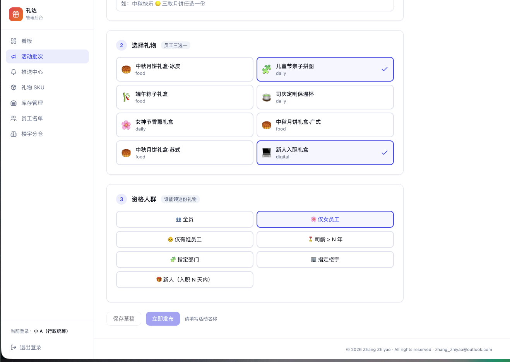

### ④ 检查 + 发布

- 还想改 → 保存为草稿
- 准备发出去 → 状态改为"进行中"，系统立刻把「你有一份福利」推给所有合资格员工

---

## 3. 活动发布后我怎么看进度？

回看板，每个进行中的活动有进度条："83/100 已领"。

点活动详情能看到：

- 谁还没领（按部门/楼宇筛）
- 推送漏斗（多少人收到 → 看了 → 点了 → 领了）
- 每个分仓的实时库存

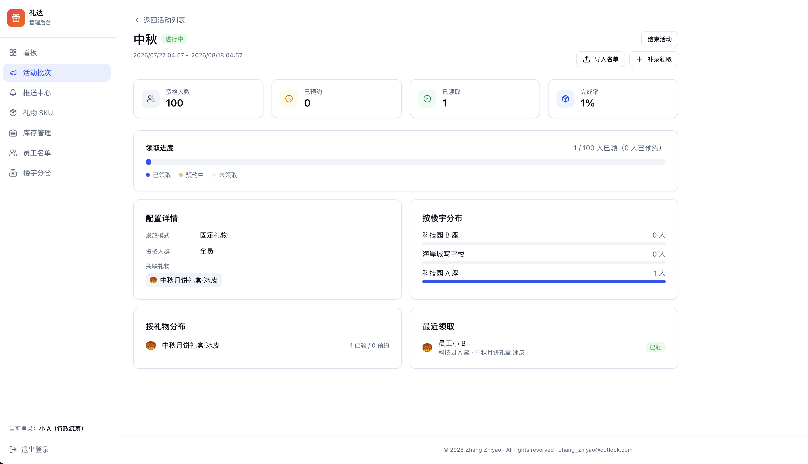

---

## 4. 库存怎么管？

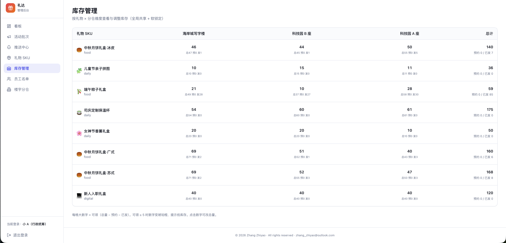

进"库存"页，看到的是一张表：横轴楼宇、纵轴礼物。每格显示"可领数 / 总数"。

- **改总数**：点格子直接改
- 系统会拦：你不能把总数改到比"被锁定 + 已发出"还少（避免负库存）

每件礼物在每个分仓有三个数字：

| 数字       | 含义                         |
| ---------- | ---------------------------- |
| **总数**   | 我们一共备了多少件           |
| **被锁定** | 已被员工预约、还没领走的数量 |
| **已发出** | 已经核销发出去的数量         |
| **可领数** | = 总数 − 被锁定 − 已发出     |

> 你只需要管"总数"。"被锁定"和"已发出"会随员工预约/取消/核销自动变化，不用碰。

---

## 5. 怎么导入员工 / 资格名单？

### 全公司员工名单

进"员工"→ "批量导入"。上传 Excel，三种冲突模式：

| 模式             | 行为                     |
| ---------------- | ------------------------ |
| 严格             | 任何一行有问题，整批不录 |
| 跳过重复（默认） | 重复的工号跳过，新的进   |
| 覆盖             | 重复的按表里更新         |

### 某个活动的特殊资格名单

有时 HR 内部规则比系统规则复杂（比如经理推荐名单）。可以手动指定：

进活动详情 → "导入名单" → Excel 上传（首列写工号）。

- **追加** —— 保留系统算出的名单，再加你的
- **替换** —— 完全用你的，不管系统怎么算

---

## 6. 怎么帮员工补录领取？

**场景**：员工出差没法亲自来，让你代领；或纸质流程已经发了但系统漏录。

进活动详情 → "补录领取" → 输工号 → 选礼物 → 选楼宇 → 确认。

系统会直接登一笔已领，跳过预约环节。库存"已发出"数 +1。

---

## 7. 怎么催还没领的员工？

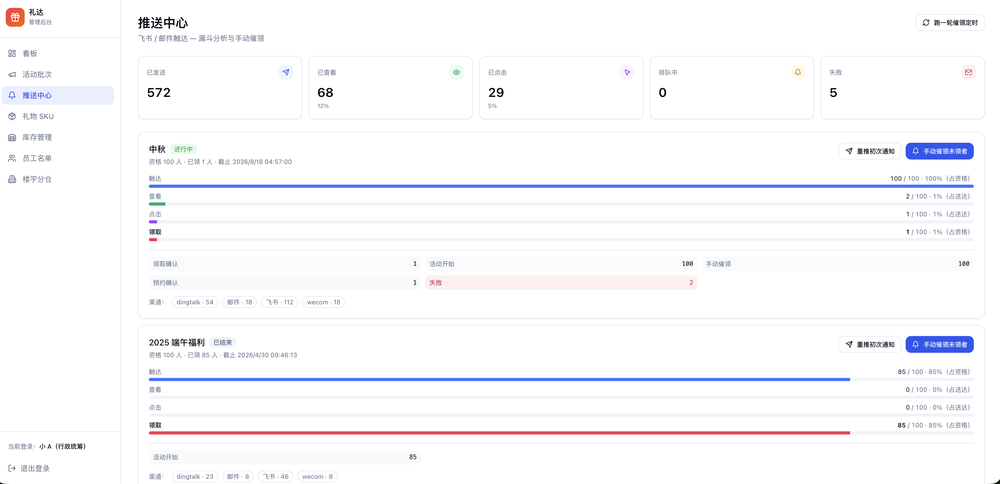

进"推送中心"，每个活动卡上有两个按钮：

- **重推初次通知** —— 把「你有一份福利」再发一遍（已收到过的人不会被骚扰）
- **手动催领未领者** —— 只发给还没领的人

**自动催领**：活动结束前 24 小时、2 小时各发一次紧急提醒，你不用管。

---

## 8. 活动结束怎么办？

**正常情况**：到截止时间系统自动关闭活动 + 释放未领的库存。**你什么都不用做。**

**特殊情况**：

- **提前关** —— 进活动详情，状态改"已结束"
- **员工反悔说要补领** —— 状态改回"进行中"、延长截止时间，然后用"补录领取"帮 ta 登

---

## 9. 怎么管员工档案？

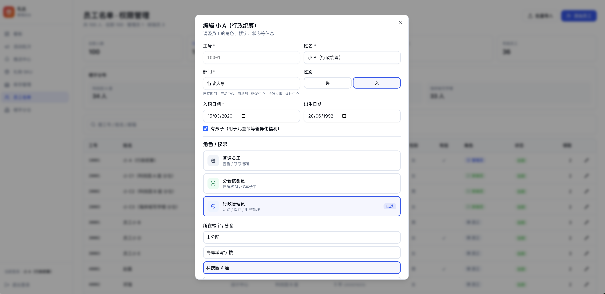

进"员工"→ 点员工右侧的铅笔。能改：

- 基本信息（姓名 / 部门 / 楼宇 / 入职日期 / 性别 / 是否有娃）
- **角色** —— 员工 / 核销员 / 管理员
- **状态** —— 在职 / 休假 / 离职

### 系统会拦的操作（防呆设计）

| 操作                       | 为什么拦                            |
| -------------------------- | ----------------------------------- |
| 改自己的角色               | 防止你把自己降级后没人能恢复        |
| 停用自己                   | 同上                                |
| 把最后一个在职管理员降级   | 必须保留至少 1 个，不然没人能管系统 |
| 把人设成核销员但没指定楼宇 | 核销员必须知道在哪个楼工作          |
| 删除有领取记录的员工       | 改成"离职"保留历史，而不是真删      |

---

## 10. 行政常见问题

### 改了员工角色 ta 没生效？

让 ta 退出重新登录就好。当前的登录状态里还是旧角色。

### 库存为 0 还能预约吗？

不能。员工那边会看到"该楼宇已缺货，请选其他楼宇"。

### 员工撤销预约后名额会还回去吗？

会，立刻释放给别人。

### 一个员工能领两份吗？

不能。一个活动每人一份是硬规则。但如果 ta 之前的预约被取消或过期了，可以重新预约。

### 怎么让活动只发给某栋楼？

创建活动时，资格规则用 AND → 加"楼宇属于 [选中楼宇]"。

### 离职员工的预约会自动取消吗？

不会自动。把员工状态改成"离职"后，跑一次"过期检查"就能清掉。

### 怎么接公司真实的飞书 / 邮件？

找 IT 配置消息推送接入即可。员工端、推送中心、漏斗统计这些都不用动。

---

# 👤 第二部分 · 员工

## 1. 我怎么知道公司发福利了？

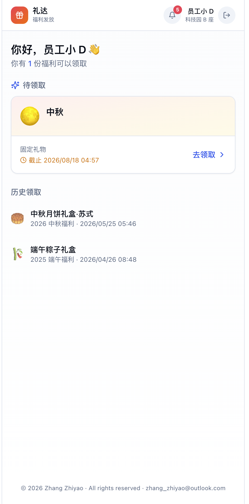

每次公司发福利，你会从这两个地方收到通知：

- **飞书消息**
- **邮件**

通知里有一个链接，点进去就能领。

如果错过了，登录员工端 → 输工号 → 在"待领取"看到所有给你的福利。

---

## 2. 怎么领礼物？

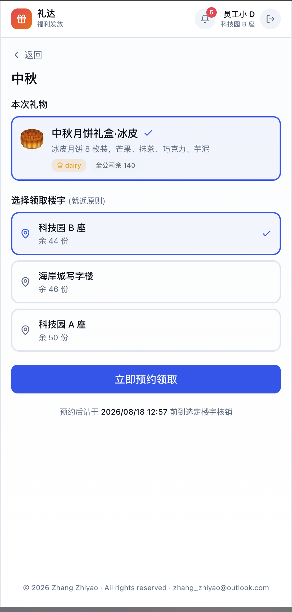

打开员工端 → 点"待领取"里的活动卡 → 进入活动详情，三步：

**① 看礼物**

- 固定礼物：直接看到这一件
- 多选一：看到几种候选，选你想要的（食品会标过敏原，过敏的请避开）

**② 选楼宇**
看哪个楼宇离你近、还有货，选一个。

**③ 确认**
拿到一个 **6 位数核销码 + 二维码**。这就是你的取货凭证。

---

## 3. 拿到核销码后怎么取？

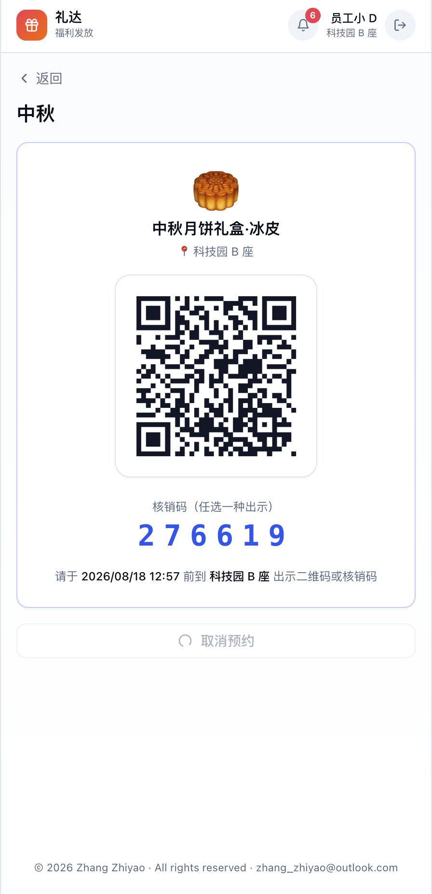

去你选的那栋楼的提货点（前台 / 大堂）。到了之后两种方式：

- **让前台扫你的二维码** —— 最快，秒确认
- **告诉前台 6 位数字** —— 手机没电或闪退时用

确认成功后前台把礼物递给你，就结束了。

---

## 4. 我反悔了能换吗？

### 想换楼宇 / 换礼物

进"待核销"找到你的预约 → 撤销 → 重新预约。

> 撤销后名额立刻还回库存给别人，重新点的时候可能选不到原来的楼宇了。

### 完全不要

直接撤销，名额还回库存。

---

## 5. 截止时间快到了我还没领会咋样？

- 截止前 24 小时 → 系统发一次提醒
- 截止前 2 小时 → 再发一次紧急提醒
- 过了截止时间还没领 → 资格作废，福利没了

> 已经预约但没去取也算"没领"，会被自动取消。

---

## 6. 员工常见问题

### 我同事收到了我没收到？

你可能不符合这次活动的资格规则（比如这次只发给有娃的，而你没娃）。问 HR 确认。

### 我能让别人替我领吗？

不能直接把码给别人。但可以让 HR 走"补录领取"流程帮你登记。找 ta 商量。

### 二维码刷不出来 / 扫码失败？

直接报 6 位数字给前台，人家手输入就行。

### 核销码会过期吗？

活动截止前一直有效。截止时间过了或预约取消就失效。

---

# ✅ 第三部分 · 分仓核销员

## 1. 我每天打开核销端看什么？

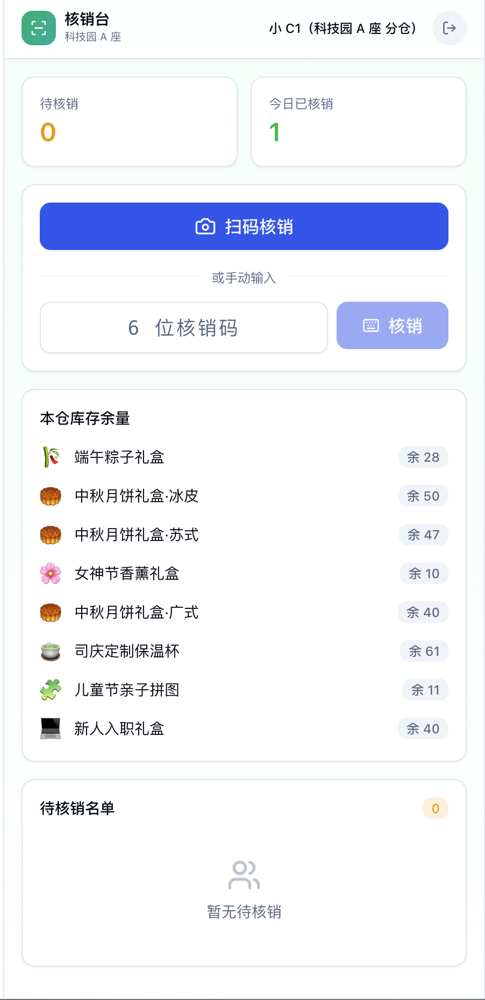

登录后看到的核销工作台分三块：

- **今日数据**（最上面）—— 我已核销几个、本楼总核销几个、各礼物还剩多少
- **待核销列表**（中间）—— 本楼宇所有已预约但还没来取的员工（最多近 50 条）
- **实时库存**（右侧）—— 每件礼物 还剩 / 被锁定 / 已发出

---

## 2. 员工来了怎么核销？

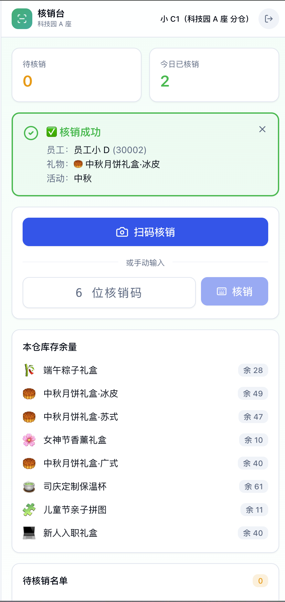

两种方式，选哪个都行：

### 方式 1 · 扫码（推荐）

点扫码按钮 → 摄像头打开 → 扫员工出示的二维码。
识别后**自动核销**，不用再点确认。

### 方式 2 · 手输码

员工手机没电、闪退、看不清二维码时用。
让员工告诉你 6 位数字 → 输入框敲进去 → 回车。

无论哪种，成功后会显示**员工姓名 + 礼物名 + 活动名**。确认无误就把礼物递过去。

---

## 3. 出现这些提示怎么办？

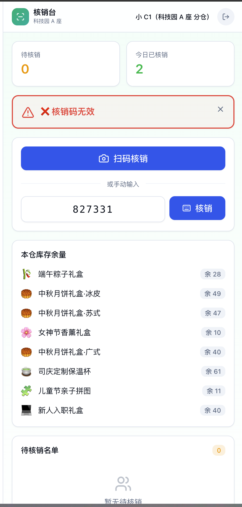

### 🟡 黄色：「请到 X 座 核销」

员工跑错楼了，礼物属于其他分仓。告诉 ta 去对的那栋楼。

### 🔴 红色：「已于 X 时核销过」

这个码已经被核销过了。看下面的细节（时间、谁处理的），可能是员工记错了，或已经领过。**不要重复发礼物**。

### ⚪ 灰色：「该预约已过期」

活动结束了 / 员工自己取消过 / 没在期限内来取。这个预约无效了，让 ta 找 HR。

---

## 4. 别的楼的核销员能扫我的码吗？

不能。系统强制：每个核销员只能核销自己负责楼宇的预约。

跨楼宇请求会自动被拒绝，并提示员工去对的楼宇。

---

## 5. 核销员常见问题

### 发错礼物了怎么办？

立刻联系 HR，让 ta 在系统里把那笔记录改正 + 给员工补一笔正确的。

### 员工说没收到通知但系统里显示有预约？

ta 可能预约后没看消息中心。不影响你核销，按正常流程做就行。

### 摄像头权限被拒 / 扫码识别不出来？

让员工报 6 位数字，手输入。如果整个核销端都打不开，换台手机或换 PC 试试。

---

# 附录

## A. 演示账号

如果你是来评估这套系统的，下面是已经预置好的演示账号。点账号直接登录，无需密码。

### 🛡️ 行政

| 工号  | 姓名 | 部门     |
| ----- | ---- | -------- |
| 10001 | 小 A | 行政人事 |

### 🎁 员工

| 工号  | 姓名 | 备注（差异化福利）                          |
| ----- | ---- | ------------------------------------------- |
| 30001 | 小 B | 男 · 研发中心 · 5 年司龄                    |
| 30002 | 小 D | 女 · 设计中心 · 有娃（可领女神节 + 儿童节） |
| 30003 | 小 E | 女 · 产品中心                               |

另有 30004 ~ 30100 共 100 个员工分布在 3 个楼宇。

### 📷 核销员

| 工号  | 姓名  | 所在楼宇     | 核销范围 |
| ----- | ----- | ------------ | -------- |
| 20001 | 小 C1 | 科技园 A 座  | 仅本楼   |
| 20002 | 小 C2 | 科技园 B 座  | 仅本楼   |
| 20003 | 小 C3 | 海岸城写字楼 | 仅本楼   |

**演示跨楼宇拒绝**：

1. 用 30001（A 座员工）预约一份礼物，拿到核销码
2. 用 20002（B 座核销员）登录、输入这个码
3. 应该被拒绝并提示"请到 科技园 A 座 核销"

---

## B. 适用节日场景

| 节日            | 福利类型                  |
| --------------- | ------------------------- |
| 春节            | 春节礼盒、年货            |
| 端午            | 粽子、咸鸭蛋              |
| 中秋            | 月饼礼盒（多种二选一）    |
| 三八妇女节      | 鲜花 / 化妆品（仅女员工） |
| 六一儿童节      | 玩具 / 童书（仅有娃员工） |
| 生日            | 蛋糕券、礼品卡            |
| 司庆 / 入职周年 | 纪念品（按司龄分档）      |

---

## C. 版本说明

- **v0.3**（2026-05）—— 消息推送、推送中心、员工消息收件箱、高并发｜性能、压力测试
- **v0.2**（2026-05）—— Excel 导入、补录领取、自动过期、角色管理
- **v0.1**（2026-05）—— 初始版本：三端、活动、领取、核销
