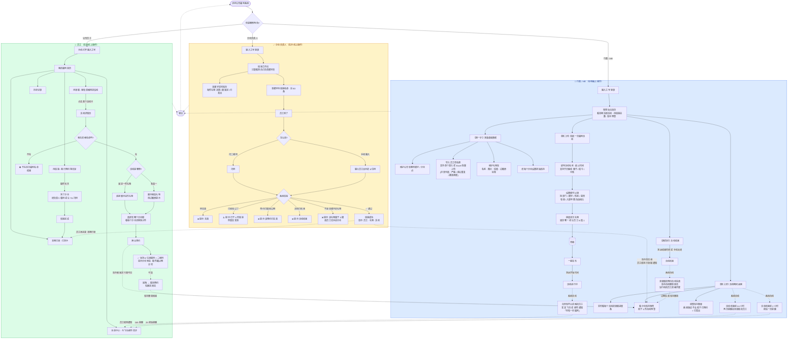
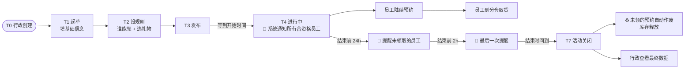
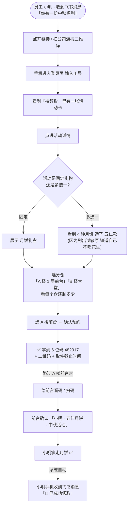
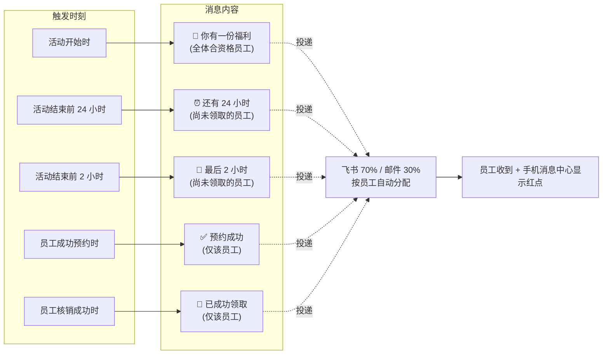
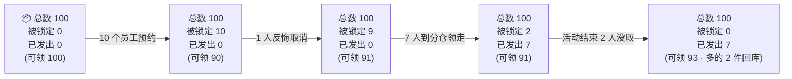

# 礼达 · 产品流程图（业务视角）

> 给完全不懂代码的同学看。覆盖整个产品三端流程：行政 HR、公司员工、分仓负责人。

---

## 0. 一张图看懂整个产品（复制即用）

---

## 1. 一次福利活动的"一生"（时间线视角）

---

## 2. 一个员工领礼物的端到端体验（最常发生的场景）

---

## 3. 通知触达地图（什么时候会收到什么消息）

---

## 4. 库存怎么变（业务语言）

每件礼物在每个分仓有三个数字：

| 数字 | 含义 | 什么时候变化 |
|---|---|---|
| **总数** | 我们一共有多少 | 行政进货 / 调整时手动改 |
| **被锁定** | 多少件已经被员工预约 但还没领走 | 员工预约 +1 / 员工取消 -1 / 员工取走 -1 |
| **已发出** | 多少件已经被员工领走 | 核销成功 +1（不可逆） |

**可领数 = 总数 - 被锁定 - 已发出**

---

## 5. 三端角色权限速查

| 能做什么 | 行政 HR | 员工 | 分仓负责人 |
|---|:---:|:---:|:---:|
| 维护楼宇 / 礼物 / 员工 | ✅ | | |
| 发起 / 关闭活动 | ✅ | | |
| 调整库存数量 | ✅ | | |
| 看全公司领取进度 | ✅ | | |
| 看自己有什么福利可领 | | ✅ | |
| 预约 / 取消预约 | | ✅ | |
| 出示码 / 二维码 | | ✅ | |
| 看自己楼宇的待核销名单 | | | ✅ |
| 扫码 / 输码 核销 | | | ✅ |
| 看自己楼宇的实时库存 | | | ✅ |
| **跨楼宇核销** | | | ❌ 严格禁止 |
